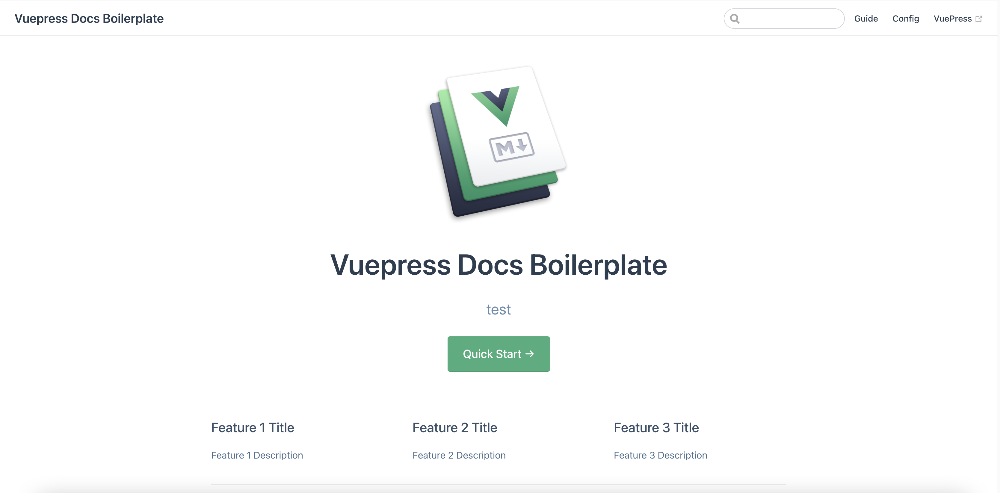

# Creating a portfolio site with Vuepress and serving for free

I will explain how to create a simple portfolio website with multilingual support. Basically, I will show how I created my portfolio site, which is current website, and how I use digitalocean to serve it, directly from github, as a static website.

## Why someone would need a website?

When I was creating this website, some of my friends asked me why I am bothering with this website and blog (this is my first post). Can't I just use my CV if the need arises? Well, of course I can just give my CV since I am not actually Front End Engineer. However, since I have a little experience with some Front End frameworks I would like to show some of my skills. In addition, I have been learning from open source code and blogs a lot and I think I should start to give back something to community now.

## What is Vuepress?

Vuepress is a static site generator with vue-based themes and plugins. It is an easy system to create a portfolio or blog website. You need to know basic syntax of Vue and basic knowledge about HTML, CSS and JavaScript. In addition, we can create our blog articles and pages easily by using MarkDown. To be honest, I only read vue syntax and general Vue concepts for several hours before starting this projects and that was I needed for Vue side. Since Vuepress is a vue-based generator, we can uses Vue components and functionality in here too.

## Project Walk-through

I am still working on this project and it might be a little different when you check it but you can access the github repository from [here](https://github.com/mustafasoylu/soylu-site).

### Project Creation

We can use npx to directly create backbone of a vuepress project by below command. You can check these steps from [Vuepress' website](https://vuepress.vuejs.org/guide/) too. I named the project, thus folder, as vuepress-project but you can name it anything you want.

```sh
npx create-vuepress-site vuepress-project
```

This might take a little time so it is time pour yourself a coffee. :coffee: You should check your terminal because you need to enter below information in order to finish the project. You can change these values later too, so you can just put something temporary if you don't want to do it now.

- Project Name
- Description
- Maintainer Email
- Maintainer Name
- Repository URL

Now we have the the backbone of our Vuepress website. However, everything is under docs folder.

```sh
cd vuepress-project
ls -al
```

Since I made this a standalone project, I moved everything under the main folder, then removed the docs folder. If you choose to move as that, simply run the below commands.

```sh
# move all folder including hidden files/folders
mv docs/{*,.*} ./

# remove docs folder
rm -r docs
```

Let's install the necessary libraries.

```sh
# install default vuepress library
npm i

# install libraries and plugins we use in this project
npm i vuepress-plugin-social-share vue-feather-icons @vuepress/plugin-back-to-top @vuepress/plugin-medium-zoom

# run development server in local
npm run dev
```

Now you can see your website from [http://localhost:8080/](http://localhost:8080/).

<figure>

<figcaption align = "center"><b>Initial Index Page</b></figcaption>
</figure>

### Project Directory Explanation

Under the "src" folder, there are three folders. ".vuepress" is the main folder where we set vuepress configuration, styles and Vue components. Everything is pretty self explanatory in .vuepress folder but you can check [the official website](https://vuepress.vuejs.org/guide/directory-structure.html) for more information.

There are two other folders and the index.md file left in src folder. index.md is simply our index page. When you check the upper bar of the index page above, you can see guide and config link on the right. Each folder creates a link for new pages and the their README.md becomes the pages. Of course, we can have sub pages such as guide/using-vue.md file that becomes http://localhost:8080/guide/using-vue.html You can make changes to the markdown files and see the changes since the development page refreshes the build when there is a change in the files.

## Setting up the Configuration

Rest is coming soon...

### Set config.js

### Create Components

#### Footer

[comment]: <> (https://github.com/yshrsmz/vuepress-theme-modern-blog)

#### Posts

[comment]: <> (find the source i used)

### Creating Blog Pages

#### Set up the Frontmatter

#### Language Considerations

## Deploy to Digitalocean

<BuyMeACoffee />

<Footer />
