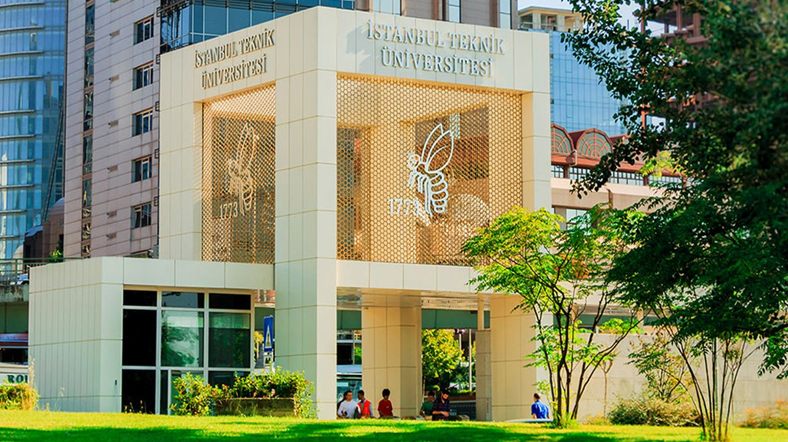
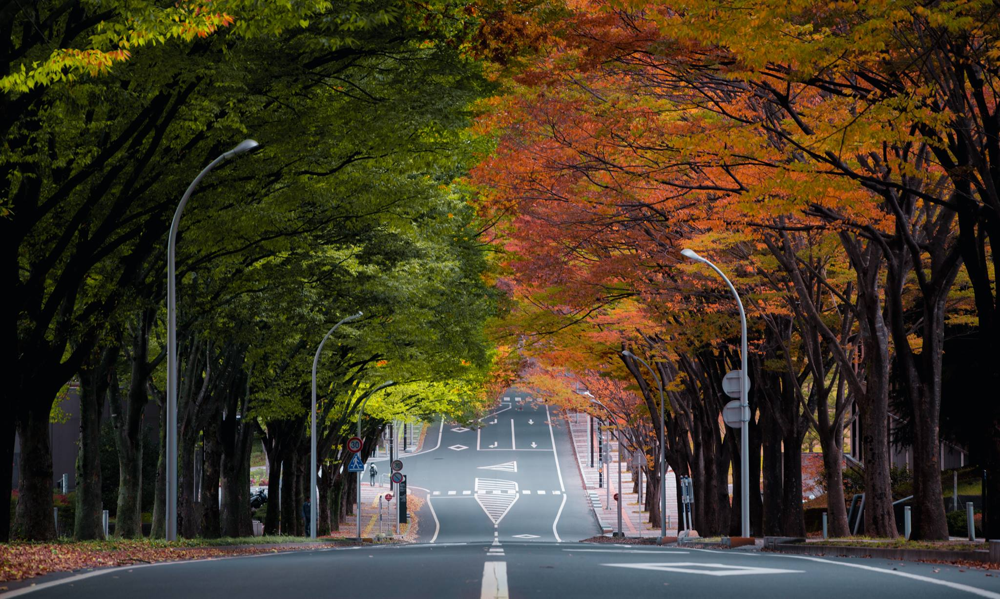

# Gidesiye Kadar

Merhaba!

Bir İTÜ öğrencisi ve Japonya'ya değişim yapan ilk kişi olarak benim çektiğim acıları çekmemeniz için başımdan geçenleri ve değişim yapmak için gerekenleri buradan anlatacağım. İTÜ tarafında yapmamız gerekenler, karşı tarafla neler yapacağız, gittikten sonra nelere ihtiyacım oldu, burs imkanı nedir, gelir gider, gezme tozma vs. vs.

**Not: Aşağıda verilen linkler veya isimler bu bloğu okuduğunuz zamanda geçerli olmayabilir.**

Ben Tohoku Üniversitesi ile değişim programına katıldığım için sizlere Tohoku ile olan iletişimi anlatacağım. Her üniversitenin başvuru zamanları farklı oluyor ama genel olarak mart sırasınları oluyor, gitmek istediğiniz üniversitenin sitesini kontrol etmenizi tavsiye ederim. Tohoku Üniversitesinin 10 Ocak gibi başlatıp, 10 Mart civarında bitiriyor başvuruları. Eğer başvurup, 1 dönem veya 1 yılınızı Japonya'da geçirmeye karar verirseniz İTÜ Uluslararası Değişim Ofisine(okul öğrenci işleri binasında) uğrayıp bu konuyla ilgilenen Sibel Güçkıran (eğer hala devam ediyorsa) ile iletişime geçenizi öneririm.

<figure>

<figcaption align = "center"><b>ITU Arı Kapısı</b></figcaption>
</figure>

Tohoku Üniversitesinin lisansta değişim için 2 tane programı var. [JYPE](http://www.insc.tohoku.ac.jp/english/exchange/jype/) ve [IPLA](http://www.insc.tohoku.ac.jp/english/exchange/ipla/). Eğer Doğal Bilimler öğrencisi(Mühendislik, Fizik, Genetik vs.) JYPE programı, sosyal bilimler öğrencisi iseniz (İTÜ'de İşletme, Endüstri gibi bölümler) IPLA programına başlayacaksınız. Bu programlarda dersler farklı fakat başvuru esnasında sizi ilgilendiren bir şey yok burayla ilgili.

### İTÜ Tarafı

Son başvuru tarihinin çok öncesinde fakültenize dilekçe yazarak kendinizi değişim için aday göstertmeniz gerekiyor, nomine edilme diyorlar bu işleme. Olabildiğince erkenden bu işleri yapmalısınız çünkü Tohoku sadece 2 aday kabul ediyor İTÜ'den anlaşma gereği. Nominasyon işlemi tamamlandıktan sonra bu bilgi Sibel Hanıma gidiyor ve o sizi İTÜ'den resmi olarak aday gösteriyor değişim öğrencisi olarak.

Resmi olarak aday gösterildikten sonra Tohoku sizi işleme alıyor ve bir süre sonra size başvuru için gerekli belgelerin olduğu bir mail yolluyor. Bu belgeleri hazırladıktan sonra Sibel Hanımla sisteme yüklüyorsunuz. Bu aşamadan sonraki aşamalar için hazirana kadar sonuçları beklemeniz gerekiyor.

### Tohoku Tarafı

Tohoku tarafından istenen belgeler aşağıdaki gibidir:

- Statement of Purpose / Study Plan: Japonya'ya, Tohoku'ya neden gitmek istiyorsunuz, orada hangi dersleri almak istiyorsunuz, Japonya'ya, Türkiye'ye ve Türk-Japon ilişkilerine nasıl katkılarınız olacak gibi sorularına yanıt verirmiş gibi yazmanız gereken bir yazı. Bence kabul için başvurunun en önemli kısmı bu. Hem teknik hem kültürel olarak gerçekleştirmek istediğiniz etkileşimleri ve kendinizi iyi anlatmanız gerekiyor.
- Official Academic Transcript
- Letter of Recommendation from each applicant’s advising professor: En önemli ikinci nokta ise bu olmalı, eğer daha okula yeni başladıysanız danışmanınız ile aranızı iyi tutmanızı, sizi tanıması size büyük bir artı olacaktır. Hocanıza bu konudaki isteğinizi kuvvetlice yansıtmanız, onun mektubuna da yansıyor çünkü.
- Certificate of Enrollment at applicant’s home university
- Certificate of Health: Çok ayrıntılı bir sağlık raporu istiyorlar. Gözden, kan ve idrar testlerine kadar bir çok sonuç istiyorlar. Birden fazla doktora gideceksiniz bunu doldurmak için ama kağıt üstünde bir çok imza istemiyorlar, bir tane yeterli. Doktorunuz bazı kelimelerin İngilizcesini bilmeyebilir, gitmeden önce kelimelerin hepsini araştırmak faydalı oluyor. Kesinlikle son bir kaç haftaya bırakılmamalı, bir çok doktordan gün almak zaman alıyor malum.
- A photocopy of the applicant's passport identification page: Gideceğiniz kesin olmamakla birlikte, başvuru için pasaportunuzun olması gerekiyor.
- A photograph of the applicant
- Application form for JASSO scholarship: İşte can alıcı nokta. :smile: Çok basit bir form aslında, tek sayfa. Sizden ortalamanızı 3 üstünden yazmanızı, ıslak imzalı taratılmış dosyayı istiyorlar. Bu bursu alabilmek için ortalamanızın 3 üzerinden 2,3 ve üstü olması gerekiyor. Ortalamanız yüksek diye size burs çıkacak diye bir kural yok, bahsettiğim diğer belgelere kesinlikle dikkat edin. Ben tam 2,3 / 3 ortalama(3,07/4 bizde) bursu aldım. Burs olarak size aylık 80000¥ veriyorlar. Bu yaşamak için yeterli bir miktar, maddi ayrıntılara başka bir yazıda gireceğim.
- A copy of the applicant's certificate of language proficiency: Şanslıyız ki YDY'nin ABET'i var. YDY'den aldığınız proficiency sınav notunuzu gösteren belge bu program için yeterli görülüyor. Fakat puanınız düşükse sene başındaki sınava girip puanınızı yükseltmenizi öneririm. Ben 84 almıştım proftan, bir sıkıntı yaşamadım dil yeterliliği belgesi olarak.

<figure>

<figcaption align = "center"><b>Tohoku Uni. Aobayama Kampüsü</b></figcaption>
</figure>

### İTÜ Tarafı - 2

Tohoku'ya yukarıdaki belgeleri ilettikten sonra, uzun bir süre beklemeniz gerekiyor. Yaklaşık haziran başlarında size kabul ve burs alıp almadığınıza dair bir mail geliyor. Kabul aldığınız varsayımı ile ilerliyorum tabii ki :smile:

Artık gidiyoruz ama orada hangi dersleri alacaksınız? Bu derslerin eşleniği var mı?

İşte bu soruların hepsini kendiniz cevaplayacaksınız. Daha önce anlattığım üzere bölümünüze göre JYPE veya IPLA programına katılacaksınız. Bu iki program için dersler farklı. Ders programınızı kendiniz hazırlayacaksınız, eşlenik dersleri İTÜ ile Tohoku arasındaki derslere bakarak kendiniz hazırlayıp bölümünüzün ilgili hocalarına onaylatmanız gerekiyor. Bunun için ilk olarak, [JYPE](http://www.insc.tohoku.ac.jp/english/exchange/jype/) veya [IPLA](http://www.insc.tohoku.ac.jp/english/exchange/ipla/) sayfalarından alabileceğiniz derslerin listesine erişin. Bu listelerde almak istediğiniz derslerin oradaki kredilerine, içeriklerini iyice inceleyein. Japonya'dayken Japonca derslerini almanız zorunlu. Bunun dışında Tohoku'da dönemde minimum 15 kredi almanız gerekiyor, dersleri seçerken bunu göz önünde bulundurun. Sırada seçtiğiniz derslerin İTÜ'deki karşılığını bulmak var. [İTÜ SİS](http://www.sis.itu.edu.tr/)'ten kendi bölüm derslerinizin içeriklerini, Ders İçerikleri sekmesinde görebilirsiniz. Eğer hocanız sorarsa aklınızda olsun, Tohoku ECTS kredisi sunmuyor, yani orada 2 kredilik dersin burada 5 kredilik olarak eşlemek gözünüzü korkutmasın, oradaki dersler kolay diye değil, sistemleri böyle. Bunu hocanıza da anlatmanız faydalı(hocaya göre zorunlu) olacaktır.

İki tarafta da benzer olan ve almak istediğiniz dersleri bir tablo olarak, içerikleri ve adları açık olarak görülecek bir şekilde hazırlamalı ve bölümünüzün ilgili hocasına imzalatmalısınız. Burda hocalarımız denklik konusunda bizden farklı düşünebiliyor. O yüzden alabildiğiniz kadar derse denklik için imza almaya çalışmanızı tavsiye ederim. Zaten hocaya götürdükten sonra bir çok revizyon yapmanızı isteyecek hocanız. Belgenin son halinin, ilk halinden çok farklı olması ihtimal dahilinde. Hoca gidip gelmekten gocunmayın. Bazı bölümlerde birden fazla hoca bu konuda yetkili oluyor, biri olmazsa diğerini deneyin :smile:

Burda, JYPE öğrencileri için bir bilgilendirme yapmak istiyorum. JYPE öğrencilerinin Japonca dışında, 2 dönem de alması gereken zorunlu Individual Research Training dersi var. Bu aslında ders değil. Bir yüksek lisans öğrencisi gibi sizi bir laboratuvara atıyorlar, seçme hakkınız da var hangi lab olacağını. Gün içinde ders olmayan her zaman labda vakit geçirip araştırma, proje yapmanız isteniyor. Tabii ki değişime geldiğiniz için hocalar çok kasmayabilir. Bu derslerde yaptığınız araştırmanın sonucunda eğer katkı yaptıysanız yazılan makalelere sizi de ekleyeceklerdir. Eğer katkınız siz Türkiye'ye döndükten sonra bile devam ediyorsa, siz orda olmasanız da adınızı yazıyorlar makalelere. Benim bu sayede 5 İngilizce bir kaç da Japonya makalede adım var. Laba olan katkınız derecesinde size saygı gösterip ekliyorlar tabii. Ben çok çalışmayayım, akademik olarak bana bir katkı sağlamasa da olur derseniz size kalmış. Lab üyeleri ve hocalarınız ile kurduğunuz iyi ilişkiler, yüksek lisans başvurularında da yardımcı oluyor. Bu derslerle ilgili tavsiyem, bu dersleri en az bir seçmeli bölüm dersine saydırmanız. Eğer hocanızı ikna edebilirseniz daha fazlasına saydırın, çok emek sarfediyorsunuz.

Bundan sonraki aşama ise, Learning Agreement oluşturmak. Eşleniğini aldığınız derslerden ilk ve ikinci dönem için bir ders planı oluşturuyorsunuz. Bu ders planını yine ilgili hocaya imzalatıp, ders eşleniklerinin olduğu belgelerle birlikte Sibel Hanıma teslim ediyoruz.

**Unutmamak gerekiyor ki okulumuzda önemli belgeler kaybolabiliyor. Kendinizi sağlama almak için elinize geçen her belgenin fotokopisini alıp saklayın. Benim bazı belgelerim kaybolmuş ve çok zor bir süreç geçirdim dersleri saydırırken.**

Alacağımız dersleri de hazırladığımıza göre, Japonya'ya gitmeden İTÜ'de yapmamız gereken son aşama kalıyor geriye. Son olarak fakültemize bir dilekçe veriyoruz, Japonya'da eğitim görmeye hak kazandım, şu eğitim döneminde izinli sayılmak istiyorum gibisinden, tam olarak ne yazmanız gerektiğini size uluslararası ofisten söylüyorlar :smile: Bu dilekçe ile Learning Agreement, davet mektubu ve nomination maili bölümün öğrenci işlerine teslim ediliyor. Gerekli işlemler yapıldıktan sonra belgeler size geri geliyor, Learning agreement'ı Japonyaya'ya giderken yanınıza alıyorsunuz.

### Tohoku Tarafı - 2

Kabul aldınız maili ile birlikte sizden isteyecekleri yeni şeyler olacak. Bunun yanında size vizeyle ve prosedürlerle ilgili bir çok bilgi veren belge gelecek, bunların hepsini okumanızı tavsiye ederim. Vize için size Certificate of Eligibility(CoE) gönderecek üniversite. Bu belgeyi alabilmeniz için aile bireylerinin gelirine kadar bir çok bilgi istiyorlar. Kabul maili geldikten sonraki yaklaşık 1 hafta içinde doldurmanızı gerekiyor.

Sonraki aşama için Temmuzu bekliyoruz. Sizden geliş tarihi için yine bazı bilgiler girmenizi istiyorlar sisteme. Yurt başvuruları da için de bu mailde bilgi veriyorlar. [Tohoku Universitesi yurtları](http://sup.bureau.tohoku.ac.jp/housing/index_en.html) sayıca ve tip olarak çeşitli olmakla birlikte, maddi olarak da çeşitli. Değişim öğrencileri İTÜ'den Tohoku'ya giden **misafir öğrenciler** oldukları için yurt kesinlikle çıkıyor. Maddi olarak sizi en rahat ettirecek olan [International House Sanjo 1](http://sup.bureau.tohoku.ac.jp/housing/kaikan_en.html) yurdunu öneririm.

Ağustos başı gibi CoE Japonya'da basılmış olup size gönderiliiyor ve size ulaşması ağustos ortasını buluyor. **Artık vize almak çok kolay!** Elinizdeki belge ve kalma süresi için yeterli zaman aralığı için alınmış pasaportunuzla Japonya Büyükelçiliğine gidebilirsiniz. Vizeniz normal ülkeye dönüş zamanınızın 3-4 ay ötesine kadar verildiği için giderken pasaportunuzda en az 1.5 yıllık olmasını tavsiye ederim. Elinizdeki CoE belgesi çok geçerli bir belge, başvurudan 3 gün sonra gel al diyorlar direk pasaport ve vizeyi. Avrupa vizelerindeki gibi, okula kabul aldım ama ülkeye vize alabilir miyim acaba? gibi bir derdimiz yok. Sizinle mülakat bile yapmıyorlar, basıyorlar vizeyi :)

**Ver elini Japonya!**

<Footer />
