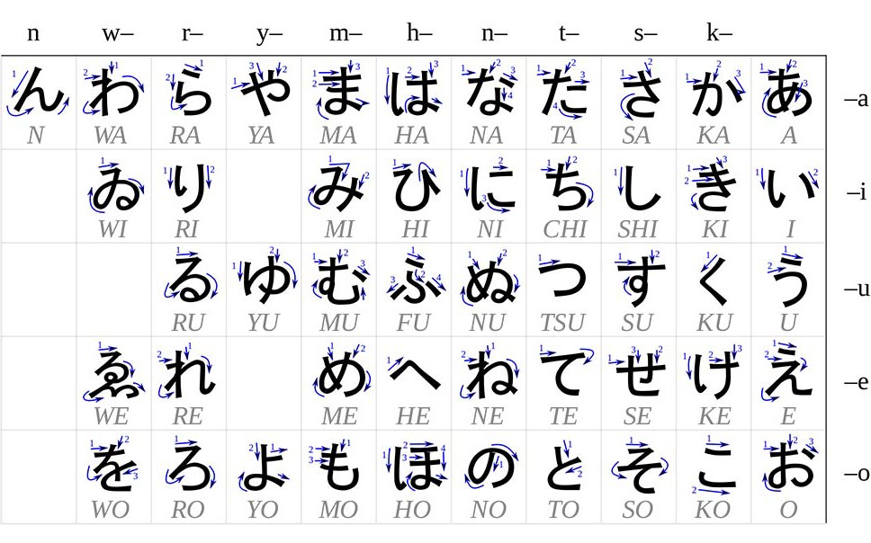

# Japonca'ya Nasıl başlamalıyım?

Merhaba!

Bu yazıda size Japonca hakkında bilgiler verip, kendi deneyimlerime göre Japonca'nın nasıl çalışılması gerektiğini anlatacağım. Öncelikle, oynat Uğur'cum!

<iframe src="https://www.youtube.com/embed/YkamZkStJzk" frameborder="0" allow="autoplay; encrypted-media" allowfullscreen style="width:100%; height:350px;"></iframe>

Videoyu birlikte çektiğimiz arkadaşımız [Cengo](https://www.youtube.com/channel/UCOZ1WV386KsHDASbfM9G3rg)'nun kanalına abone olmayı unutmayın :wink:

## Japonca Hakkında Bilgiler

### Japonca'nın Dünya Dilleri Arasındaki Yeri

Japonca'nın hangi dil ailesine ait olabileceği, uzun zamandır üzerinde tartışılan bir konudur. Bu konuda iki adet teori vardır. Türkçe ve Korece'nin de içinde bulunduğu Ural-Altay dil ailesinin bir üyesi olduğu bu teorilerden biridir, gramer yapısındaki benzerlik açısından bence olası bir teoridir fakat son zamanlarda çok sorgulanmakta.

İkinci teori ise, Japon ve Okinawa dilleri olarak tamamen izole, kendi içinde bir aile olduğudur, son zamanlarda tutulan bir görüştür.

### Japon Yazı Sistemi

8. yüzyılda, Çince karakterleri(kanji) kendi dillerinde kelime veya ideogram olarak değil de, hece belirten işaretler olarka kullanmaya başlamışlardır. Bu sistemden, kanalar doğmuştur. Hiragana ve katakana olarak iki alfabe olarak türeyen bu işaretlerin hepsi bir kanjiden türemiştir. Hiragana karakterler yumuşak hatlara, katakana karakterler sert hatlara sahiptir. Kanalar sadece ses ifade ederken, ideogram olarak tanımlanan kanjiler bir fikri işaret ettikleri için, hem ses hem anlam ifade eder. Bir kanjinin bir çok okunuşu olabilir.

### Hiragana(ひらがな-平仮名)

Ekler, edatlar, direk Kanjiyle kullanılmayan bazı kelimeler için kullanılır. Ayrıca, Kanji ile yazılan fiiller hiragana-kanji kombinasyonu olarak yazılır.

<b>飲む &rarr; içmek</b>

Ayrıca kanjinin okunuşunu bilmeyenler için, kanjinin üstüne hiragana okunuşu da yazılabilir, buna is Furigana denir.

<b><ruby>漢字<rt>かんじ</rt></ruby> &rarr; kanji</b>

### Katakana(カタカナ-片仮名)

Yabancı kelimeler, telgraf ve belirli yansıma kelimelerde kullanılır. Ayrıca vurgulanmak istenen bir kelime varsa katakana olarak yazılabilir.

<b>ロケット &rarr; roket, ピカピカ &rarr; parlak</b>

### Kanji

Çince'den Japonca'ya geçen bu karakterlerin iki çeşit okunuşu vardır. Çince'den geçen okunuşlara <i>onyomi</i>, Japonca okunuşlar ise <i>kunyomi</i> olarak adlandırılır. Kanjilerin birden fazla onyomi ve kunyomi okunuşları olabilir. Filler(yardımcı eylem almayanlar) kanji ve hiragana kombinasyonu ile yazılır(<ruby>飲<rt>の</rt></ruby>む). Bir kanji farklı hiragana kombinasyonlarıyla farklı ama yakın anlamlı kelimelere dönüşebilir.

<b><ruby>下<rt>さ</rt></ruby>げる</b> &rarr; (dekorasyon) asmak

<b><ruby>下<rt>した</rt></ruby></b> &rarr; alt

<b><ruby>下<rt>くだ</rt></ruby>る</b> &rarr; aşağı inmek

<b> <ruby>下<rt>もと</rt></ruby> </b> &rarr; altında(etki veya rehberlik)

Japonca'da çok fazla sesteş kelime bulunmakta ve kanji kullanımı bu karmaşıklıkları önlemek için uygun bir yapıdır. Kanjiler, farklı zamanlarda Çin'in farklı bölgelerinden alındığı için birden fazla onyomi okunuşları da vardır. 1946 ve 1981 yıllarında dilde sadeleşme hareketine gidilmiş ve son aşamada 1945 adet kanji "Günlük kullanımdaki karakterler listesi"ne girerek sadeleşmeden geçmiştir. Ayrıca, Çince'de olmayıp Japonlar tarafından oluştuurlan kanjiler de az da olsa vardır.

## Nasıl Japonca Çalışmalıyım?

Japonca öğrenmeye başlamak için ilk adım hiragana ve katakana öğrenmek olmalı. Gramer kitapları hiragana ve katakanadan oluşuyor, kanjilerde ise furigana var. Bizim latin alfabesi dediğimiz alfabeyi ise Romaji(Roma karakterleri) olarak adlandırıyorlar ve pek görmüyoruz kitaplarda.

### Hiragana ve Katakana

Kanaları neden öğrenmemiz gerektiğini anladığımıza göre, nasıl öğrenmemiz gerektiğine geçebiliriz. Hiragana ve Katakana karakterlerini ve çizim sıralarını aşağıdan görebilirsiniz. Çizim sırasının yararlarını kanji öğrendiğiniz zaman göreceksiniz. Linklerde gördüklerinizi temel heceler olup, başka hecelere kaynak da oluyorlar, kana dersimizde göreceğiz.

<figure>

<figcaption align = "center"><b>Hiragana çizim sırası</b></figcaption>
</figure>

<figure>

<figcaption align = "center"><b>Katakana çizim sırası</b></figcaption>
</figure>

Kanaları ve kanjileri öğrenmek için temel yöntem çok basit aslında, kusuncaya kadar çizmek...

Sadece çizince sıkılabileceğimiz için farklı yöntemler de bulmak önemli aslında. Benim en sevdiğim yöntem şarkı sözü yazmak. Hiragana ve katakanayı birkaç kez yazıp artık belli bir kalıcılığa geldikten sonra, en sevdiğiniz Japonca müzikleri hiragana veya katakana olarak yazın. Seçtiğiniz bir şarkıyı sadece bir kanada yazmanızı tavsiye ederim. Şarkıyı dinleyin ve yazdığınız kağıttan takip edin. Bu işlemi gerçekleştirdikten bir süre sonra artık kağıt olmasa da sözler Japonca olarak gözlerinizin önüne geliyor. Böylece sevdiğiniz şarkıları her dinlediğinizde Japonca da çalışmış oluyorsunuz otomatik olarak :smile:

### Kanji ve kelime dağarcığı

Bu konuyu birlikte alıyorum çünkü çok bağlantılılar. Kanji bildikçe kelimeleri hatırlamanız daha kolay oluyor çünkü kelimeler kanjilerden oluşuyor ve kanjiler bir fikri temsil ediyor. Eğer bir kelimeyi oluşturan kanjileri bilirsek anlamak da çok kolay oluyor. Örneğin, ka(火) ateş demek ve san(山) dağ demek. İkisini birleştirince kazan(火山) volkan demek oluyor. Tabii ki kelime ve kanji çalışmak için de en temel yöntem milyonlarca kez yazmak. Buna karşın, 2000'den fazla kanjiyi sadece elle yazmak, hepsini hatırlayabilmek için yeterli değil. Kitap okumak dili geliştirmek için diğer ve bence en iyi yöntemlerden biri. Buradaki sıkıntı ise, kitaplarda işkence oluyor. Bu yüzden başlangıç seviyesinde okuyabileceğimiz 2 kaynak var: masallar ve mangalar. Masallarda kanji çok az oluyor, olursa da furiganası kesinlikle oluyor. Mangalarda kanji bol da olsa hepsinin furiganası var. Tabii bunların okumanın da artısı eksisi var. Artısı, okuyabiliyor olmak. :smile: Eksisi ise masallarda dil biraz eski oluyor, mangalarda ise kaba oluyor. Bunları göz önünde bulundurup yine de okumak gerektiğini düşünüyorum. Okumaya ilk başladığınızda bilmediğiniz kelimeleri not almalı ve olabildiğince tekrar etmelisiniz. Çok fazla bilmediğiniz kelime çıkacağı için yavaş başlarsınız ama zaman geçtikçe hızlanacaksınız. Gelişiminizi görmeniz ve motive olmanız açısında ben okurken zaman tutmanızı öneririm.

<figure>

<figcaption align = "center"><b>Örnek bir kanji</b></figcaption>
</figure>

Tabii ki kanji ve kelime çalışmak için bir çok web ve mobil uygulama ve site de mevcut. Ben de zamanında farklı uygulamalar kullandım ve sizi içlerinde en çok beğendiğim bir mobil uygulama ve bir siteyi tanıtacağım.

#### [Wanikani](https://www.wanikani.com/)

Wanikani</a> size hem kanji hem de kelime öğrenmede yardımcı olan bir site. Japonca &rarr; İngilizce, yani bu uygulamayı kullanmak için İngilizce bilmek ve ayrıca hiragana ve katakana bilmek de şart. Tek eksisi aylık ücreti olması ama ben getirisinin aylık ücretine oranla çok çok iyi olduğunu düşünüyorum. Kanjiler, radikal denilen parçalardan oluşmaktadır. Bu radikallerin belirli bir anlamı olabileceği gibi, olmayadabilir. Wanikani size kanji ve kelime öğretmeye radikallerden başlıyor. Bir seviyede, size ilk önce radikalleri, gerçek anlamlarıyla veya üzerine kendi yükledikleri anlamlarla gösteriyorlar. Sonra bu radikalleri içeren kanjileri gösteriyorlar. En son olarak da öğrendiğiniz kanjileri içeren kelimeler geliyor. Radikallerden oluşan kanjilere de radikallerden yola çıkarak zaten olması gerekne anlamları veya kendi uydurdukları anlamları yükleyerek, tüme gelim yaparak hikayeler oluşturuyorlar. Bu hikayeler mantıklı da olsa saçma da olsa akılda kalıcılığı yüksek oluyor. Aynı şekilde de, kanjilerden kelimelere gidiyoruz.

Peki öğrenme nasıl oluyor? Size bir radikal, kanji veya kelimeyi anlamı ve okunuşunu ilk defa gösterdikten sonra belirli aralıklarla soruyor. Her ifadenin bir seviyesi var, ilk öğrendinizde Apprentice I oluyor kelime. 3 saat sonra size okunuşu ve anlamını soruyor, doğru yaparsınız Apprentice II oluyor ve 8 saat sonra bir daha soruyor. Eğer hata yaparsanız Apprentice I kalıyor ve 3 saat sonra tekrar soruyor. Gördüğünüz üzere burdaki öğrenmenin temelinde tekrar var. Her ifadenin kendi sorulma zamanı var, 7/24 tekrar geliyor. Bu kadar tekrar ettirdiği için, gördüğüm en iyi dil öğrenme uygulaması gördükleirm arasında. Zamanınızı çok istiyor ama karşılığını da veriyor. Düzenli yapılması tavsiyemdir yoksa çok fazla tekrar birikiyor ve ilerlemek zorlaşıyor. İlk 2 seviyesi ücretsiz olup toplam 60 seviyeden oluşuyor. Sitenin kendisine ek olarak kullanıcıların yazdıkları script'ler kullanım kolaylığı ve takip konusunda çok yardımcı oluyor. Kesinlikle denemenizi tavsiye ederim. (Bence her seviye sonunda en azından 5 kere yazmalısınız yeni öğrendiğiniz kanji/kelimeleri)

[Tangoristo](http://www.tangoristo.com/)

Tangoristo size içeriklerinin furiganalarını ve İngilizce anlamlarını sunuyor. Peki nedir bu içerikler?

- Japonya'nın TRT'si olan NHK kanalının haberlerinin kolay versiyonu
- NHK Haberlerinin ileri seviye olan normal halleri
- Matcha Gezi Dergisi
- Japon masalları

Ayrıca farklı özellikleriyle de kullanım kolaylığı sağlıyor ve Japonca öğrenen her seviyedeki insan için kullanılabilir. JLPT seviyelerine göre de furiganaları açıp kapatabiliyorsunuz. Bu sayede seyinize de öğrenebilirsiniz. Tabii ki söylediklerim dışında da bir çok özellik var, bir göz gezdirin derim.

### Dil Bilgisi

En başta anlattığım üzere dil yapısı bizimkine benzeyen bir dil. Sondan eklemeli ve Türkçe'deki gibi temel yapısı "Özne + Tümleç + Yüklem" şeklinde. Türkçe'deki ses uyumları, kaynaşma gibi konuları bir yabancının gibi bakarsak gerçekten zor konular. Aslında Japonca Türkçe'ye benzeyen ve bize göre öğrenmesi kolay bir dil, özellikle İngilizce gibi bir dille kıyaslarsak. Yönelme eki olan -e ve bulunma eki olan -de, Japonca'da da aynı şekilde de olarak kullanılıyor. Japonca konuşurken kullandığımız ekler, yani konuşma şeklimiz, karşımızdaki kişiyle olan ilişkimize göre değişiyor. Hocamızla konuşmamızla bir arkadaşımızla konuşmamız arasında çok fark var, farklı ekler dışında özel saygılı kelimeler de kullanmamız gerekiyor. Manga ve animelerde kullanılan dil çok kaba olmakla birlikte, çok yakın arkadaşlarınız dışındaki insanlardan duyabileceğiniz veya söyleyebileceğiniz bir konuşma tarzı değil. Bu konu çok önemli ve özellikle hocalarınız ve yaşça büyüklerinizle konuşurken dikkat etmeniz gerekiyor.

Nerden çalışmamız gerektiine gelince, benim başlangıç seviyeleri için önerim [Minna no Nihongo I](https://www.amazon.com/Minna-Nihongo-Book-Bk-Japanese/dp/4883191028) ve II kitapları. Minna no Nihongo serisi tabii ki Japonca ve çalışabilmek için hiragana ve katakana bilmek zorunlu. Zaten benim de başta bahsettiğim üzere bu iki alfabeyi öğrenmeden gramere başlamak doğru bir karar değil. Örnekleri bol olan bu kitapta hiç bir alıştırma pas geçilmemeli. En önemli artısı ise bu kitabın [English Translation and Grammatical Notes](https://www.amazon.com/Minna-Nihongo-Honyaku-Translation-Grammatical/dp/4883191079/ref=sr_1_1?s=books&ie=UTF8&qid=1540562248&sr=1-1&keywords=minna+no+nihongo+grammatical+notes) adlı yardımcı kitabı. Her ünite öncesi başvurulması gereken bu kitap, ünitenin kelime bilgisini size hiragana/kanji, katakana &rarr; İngilizce olarak veriyor başlangıçta. Dil bilgisini rahatça anlamak için bu kelimeleri iyice öğrenip, direk dil bilgisine odaklanabilmek büyük bir yarar sağlıyor. Size ek kelime bilgisi sağlıyor ve dil bilgisi kalıp/kurallarını İngilizce olarak açıklıyor. Özellikle kendi başına çalışmak isteyenler için inanılmaz bir kaynak. İlk büyük zorluğu atlattıktan sonra Japonca'ya kendiniz de bu yöntemlerle çalışabilirsiniz.

<BuyMeACoffee />

<Footer />
