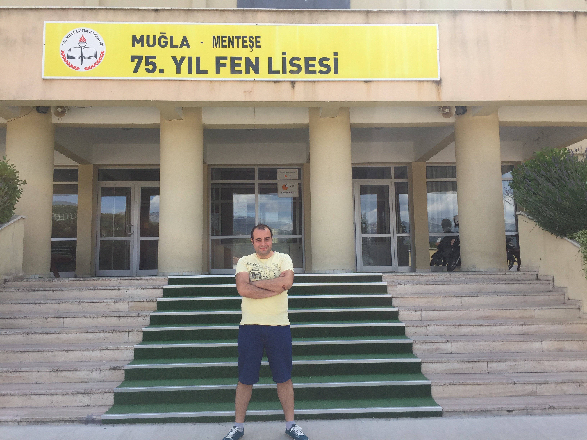
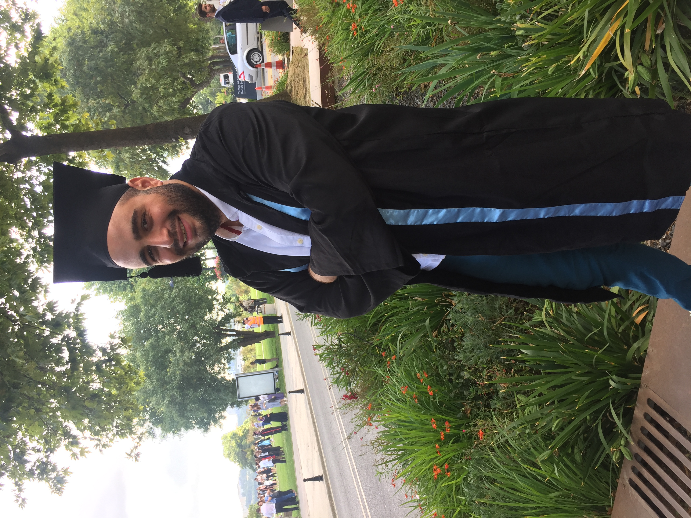
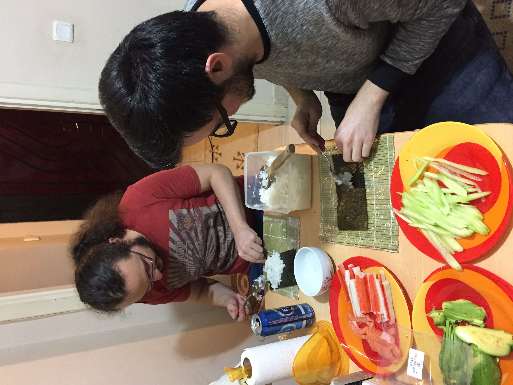
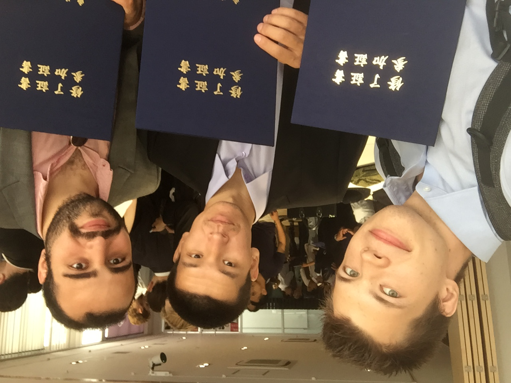

# About Me

Hello! I will briefly talk about myself on this page. I was born on 22 February 1994 in Izmir, Turkey. I was named Mustafa after my late grandpa calling the firstborn son after grandpa is a custom in Turkey.

## Academic Life

In my childhood, I always had math in mind, so I did not even think about going anywhere but a prestigious scientific high school near my region. I started Mugla 75th Year Scientific High School in 2008, in another city in my area (near 250 km away). Since I was raised as a free soul, I wanted to have an adventure in my early life and made this choice. I passed a fun but unhealthy life thanks to constantly getting poisoned by school food. I was elected as School President in my 3rd year in school, which came with an excellent election campaign thanks to my classmates and exceptional team. However, I had to leave the school after my presidential term ended in the 4th year of high school because constant food poisoning led me to be hospitalized and realized that if I wanted to survive, I needed to take action. I moved back to my parents’ place and enrolled in a private high school for my remaining time in high school.

<figure>

<figcaption align = "center"><b>Visited my high school after years</b></figcaption>
</figure>

As for the university, I was confused about which university or what department to choose. My friends and I had no guidance or no one to ask in this regard, so we decided on our departments without knowing much about them. I chose Istanbul Technical University because it is the best engineering (we even have an idiom about ITU in Turkish). My department had the highest points in the university so… Anyway, I learned that I made a big mistake by choosing Electronics and Communication Engineering, but it was too late :sweat_smile:

<figure>

<figcaption align = "center"><b>Graduation from ITU</b></figcaption>
</figure>

While studying for my departmental courses, I also learned my long passion, Japanese, from high school. Private Japanese lessons were expensive, and the university’s Japanese courses constantly contradicted my departmental courses, so I studied them mostly myself. Except, I got a term of Japanese class from a University Club called Far East Languages and Cultures. This fateful meeting later continued me giving basic level Japanese classes myself and being the club president later.

<figure>

<figcaption align = "center"><b>Making sushi with my best mates</b></figcaption>
</figure>

In my second year of university, I applied for the exchange in Japan for Tohoku University. Why Tohoku University, you ask? Because only they had enough courses to ruin my whole year (still not many credits, though). I knew I could go to exchange from ITU to Japan before entering ITU because I met one of the Professors in my department before applying. I can say this possibility is one of the huge reasons I chose ITU. I had a great year in my exchange period with lots of papers and fun. You can check [my Google Scholar profile](https://scholar.google.com/citations?user=6xP0EqsAAAAJ&hl=en) too! I thank JASSO for providing me with a scholarship for exchange at that time. If I did not have the scholarship, I could not even think about the exchange. You can learn more about the scholarship and exchange at Tohoku university from [here](/japan/).

<figure>

<figcaption align = "center"><b>Completion of exchange ceremony</b></figcaption>
</figure>

Finally, yes, this is final; I will talk about my Master’s Degree at Tohoku University. I applied for the MEXT Scholarship from the Japanese Embassy in Turkey. This scholarship provides for the school tuition fees and monthly near 145000 yens. As you can imagine, it is quite enough if you are living anywhere but Tokyo in Japan. It is incredibly competitive since only ten people can take it in Turkey, including all practices. However, I got the scholarship and finished my degree in Applied Information Sciences. Again, I thank the Japanese government and the embassy for their help. I could not achieve my dream of living in Japan without their support! You can learn more about the MEXT scholarship process from [here](/japan/).

<figure>

<figcaption align = "center"><b>This time graduating from Master's Degree</b></figcaption>
</figure>

By the way, do I do anything related to my academic subjects in my work?

A BIG NO! :upside_down_face:

## Work Life

I am not sure if it counts, but I worked in high school summers in heavy industry with my father since we had some financial problems at the time.

I have many interests, and I had an exceptional variety of subjects in university, so I have worked on a different project in my short work life. As for real working in my field, it starts with Aselsan, a military R&D company in Turkey, mainly working for the Turkish Army. I worked here for six months as a long-term intern, spending half my month in Istanbul for university and half in Ankara for working. I cannot go into details, but I was working on a circuit design using VHDL. It was the best paying company in Turkey with lots of extras, but I wouldn’t say I liked the working environment and the job, so I chose not to work with them full-time.

Then, I started working in Garanti Technology as Mainframe System Administrator just after graduating. Garanti Technology works for Garanti Bank, one of the biggest banks in Turkey, with near 3000 engineers, analysts, and so on. The company just changed its CEO before I started, so it had the mindset of a modern software company. I have also seen the existing company culture nurture this modern mindset. I had a great team there that had lots of friends from my department, even my thesis partner. However, I could not enjoy working on Mainframe was thinking of leaving the company or changing position if possible, even if I did not get the scholarship from the Japanese government for a Master’s Degree.

Currently, I am working at Trajectory ltd in Japan, which I started after graduating with a Master’s Degree from Tohoku University. Before you say anything, let me explain that my company is not one of the black ones you always hear about in Japan. It is a start-up company (at the time of writing this) with a modern mindset that surprised me. I had my doubts about finding a job in Japan. I am doing multiple things in my current position, Full Stack Engineer. They are giving me quite a space to do something in my way, so I am trying new technologies and frameworks. I have a Deep Learning project with several servers that I wrote with python and node.js. In addition, I have several Front End projects with React and PHP/basic HTML. You can say I am never bored!
